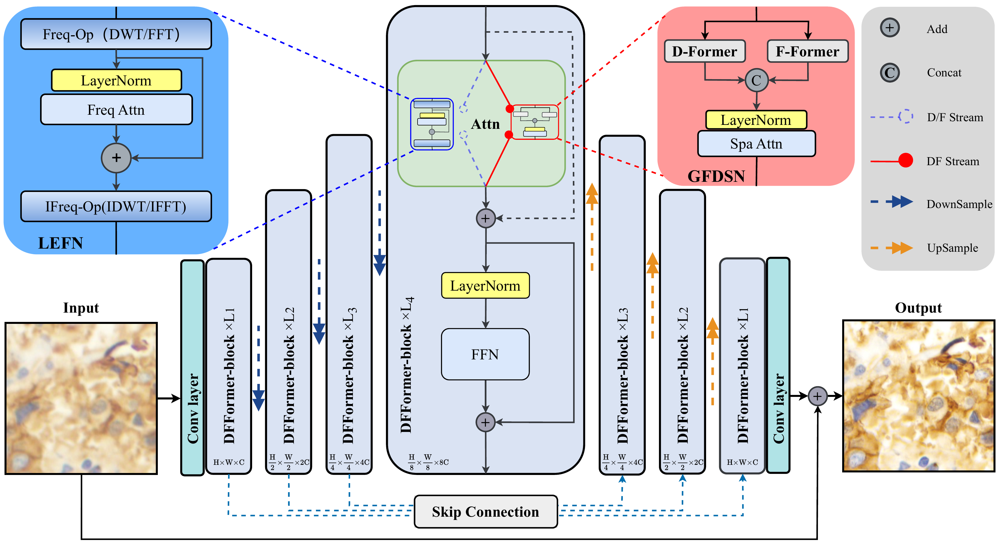
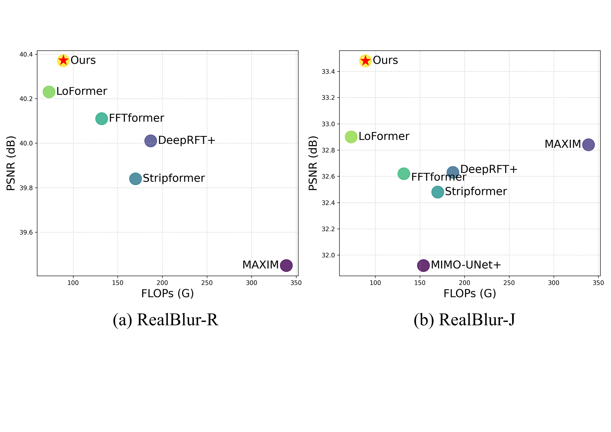

# DFFormer


Architecture of DFFormer. A U-Net serves as the backbone, where each DFFormer block restores features in the frequency domain first and then refines spatial structures. Specifically, the Dual Frequency stream contains two LEFN modules equipped with DWT/FFT operations (D/F stream) to handle global and local frequency components. The restored features are subsequently mapped back to the spatial domain and enhanced by GFDSN (DF stream) for precise detail localization, followed by a Feed-Forward Network (FFN) module.


Comparisons of the proposed method and state-of-the-art ones on the RealBlur-R and -J dataset in terms of PSNR and FLOPs.

## 1. Install

```bash
pip install -r requirements.txt
```

Edit dataset paths in `configs/train_realblur_j.yml` and `configs/train_realblur_r.yml` before running.

## 2. Train

RealBlur-J:

```bash
torchrun --nproc_per_node=8 basicsr/train.py -opt configs/train_realblur_j.yml --launcher pytorch
```

RealBlur-R:

```bash
torchrun --nproc_per_node=8 basicsr/train.py -opt configs/train_realblur_r.yml --launcher pytorch
```

## 3. Test

RealBlur-J:

```bash
python scripts/test_realblur.py --yaml_file configs/train_realblur_j.yml --weights /path/to/net_g_latest.pth
```

RealBlur-R:

```bash
python scripts/test_realblur.py --yaml_file configs/train_realblur_r.yml --weights /path/to/net_g_latest.pth
```

## Cite

```bibtex
@article{guo2026dfformer,
  title={DFFormer: Dual Frequency-Driven Transformer for real-world image deblurring},
  author={Guo, Ruizhe and Zhang, Shichuan and Li, Jingxiong and Shui, Zhongyi and Zhu, Chenglu and Yang, Lin},
  journal={Computer Vision and Image Understanding},
  pages={104763},
  year={2026},
  publisher={Elsevier}
}
```
